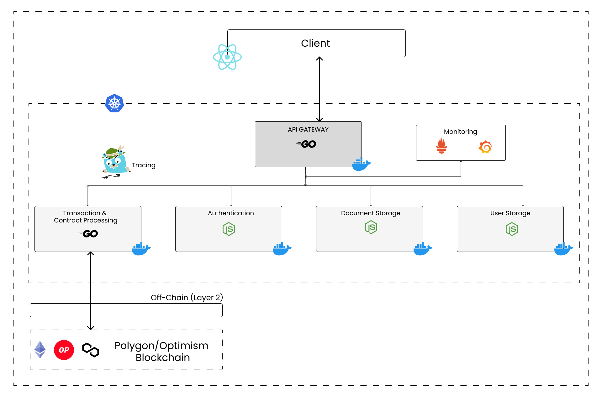

<h1 align="center">Petrovedge</h1>

## Problem Statement

Despite the high rate of ownership in India today, the poll revealed that there is a general lack of security over property rights, with nearly half of all renters and one in four owners expressing concern about losing their apartment. About two-thirds of all civil lawsuits in India are connected to land and property, where disputes over title can slow down real estate transactions and result in protracted legal disputes.

Urban poor people are especially vulnerable as a result of insecure land rights since they frequently aren't aware of the rights they do have, can't afford attorneys, and live in constant fear of being evicted. Their lack of documentation, including land titles, and disputes with family members over property ownership were the major causes of their instability.

According to the research, a lack of official documents establishing ownership can restrict access to financial services like raising loans against a home or farm for investment as well as essential amenities like power, water, and sanitation. It can also restrict access to state assistance, such as food or fertiliser subsidies, and local government services, such as water and sanitation, in developing nations.

Although just half had done so in the past, owners were more inclined to visit government agencies to update their records. Owners of residential land were far less likely to update land records than owners of agricultural land.

There may be answers to the issue of insecurity if individuals are prepared to discuss ownership with governmental officials.

## Author

- Siddhant Prateek Mahanayak
- Barat Nikhita
- Shahana Shamim
- Rishu Kumar 